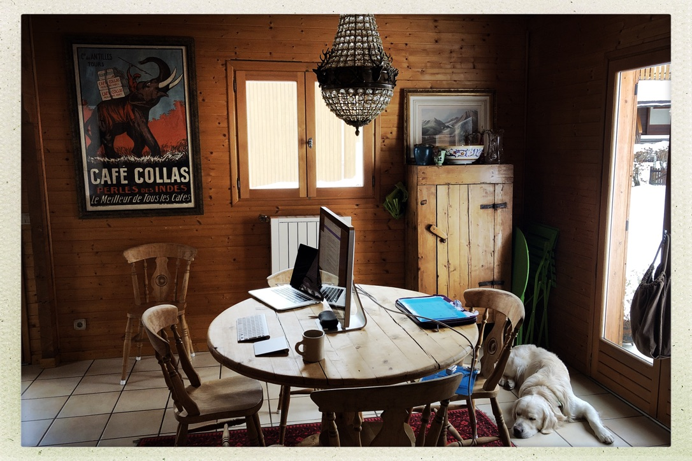
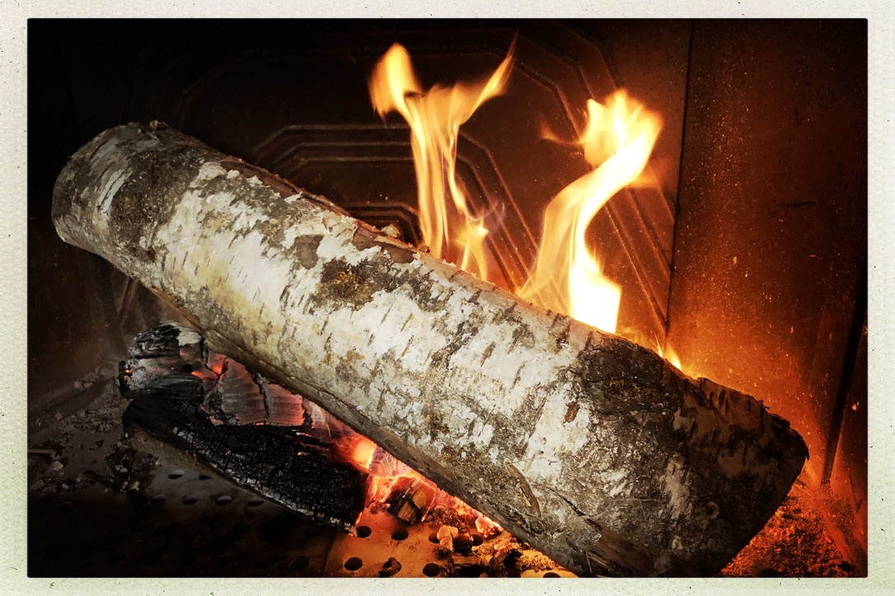
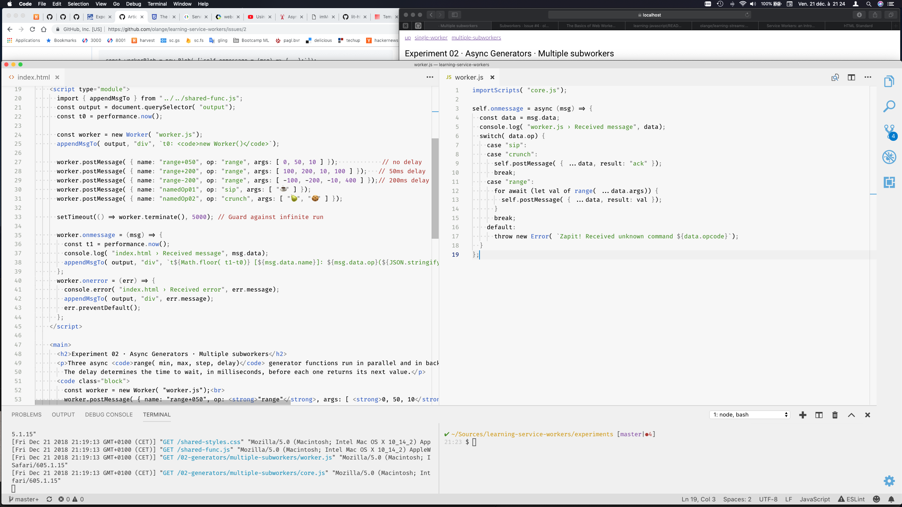
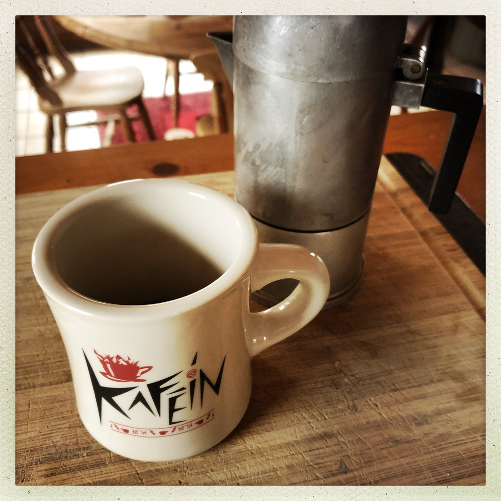
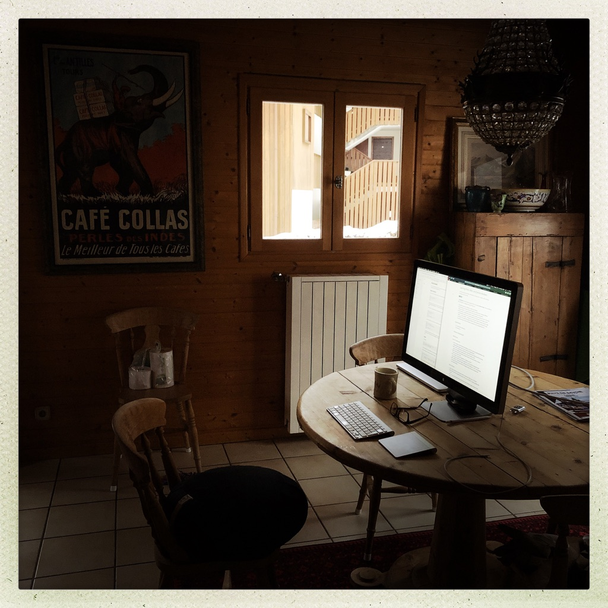

# Code retreat 12.2018

Contamines-Montjoie, 4 days in a chalet, with Caju. Code & study, quietly.

## Subjects examined & experiments

* [Learning Web Workers](https://github.com/olange/learning-service-workers/)
  * [Synthesis](https://github.com/olange/learning-service-workers/blob/master/learning/basics-of-web-workers.md)
  * [Experiment 01 · Instantiating Workers](https://olange.github.io/learning-service-workers/experiments/)
  * [Experiment 02 · Async Generators](https://olange.github.io/learning-service-workers/experiments/)
  * [Experiment 03 · Transferable objects](https://olange.github.io/learning-service-workers/experiments/)
* [Learning JavaScript](https://github.com/olange/learning-javascript/)
* [@thi.ng/Intervals](https://github.com/thi-ng/umbrella/tree/master/packages/intervals)

## Future retreat, where to resume

* [Learning Service Workers](https://github.com/olange/learning-service-workers/) research track
  * [Experiment 06 · Re-route fetch of data to worker](../issues/8) streaming data in & out a worker
  * [Learning Service Workers › Service Workers: an Introduction](https://developers.google.com/web/fundamentals/primers/service-workers/) GWF, Matt Gaunt
  * [Learning Service Workers › The Year of the Streams](https://jakearchibald.com/2016/streams-ftw/) Jake Archibald
  * [Declarative Router](https://jakearchibald.com/2019/service-worker-declarative-router/) Jake Archibald, 07.01.2019
  * [Learning Service Workers › Service Workies](https://serviceworkies.com/) mastery game
* [Learning Streams and Observables](https://github.com/olange/learning-streams/) research track
* [Reactive.howi](https://reactive.how/) online resource
* [MDN › IndexedDB API](https://developer.mozilla.org/en-US/docs/Web/API/IndexedDB_API)
