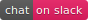

# Code retreats `GOTO :flow`

Once in a while, we should retreat to study, practice, enjoy quiet time, meditate.
Get insights, get inspired, by the practice, by others amazing work.
Be honest. Step out of the frame. May be it is not that much about us.

Coding is very much about writing. Symbolic languages, natural languages.
Writing revolves around inspiration – or none, passing time, insights,
culture, knowledge and effort, rest, never ending practice.

And forget not taking a break, feed the fire to stay warm,
walk Caju the dog, breathe, and celebrate the happy times.

## Code retreats

* [February–March 2019 · 5 weeks · Contamines-Montjoie](201902-code-retreat/README.md)
  Focus on learning streaming data pipes with Streams and Lit-Element; and visualization experiments with Web Components, ObservableHQ, VEGA, D3 and THREE. Walk in snow, cook at home, quiet time, super happy dog.
* [December 2018 · 4 days · Contamines-Montjoie](201812-code-retreat/README.md)
  Focus on learning Web Workers & experiments. Enjoy the fire. Coffee. Happy dog.
* [May 2017 · 2 weeks · Cornwall & London](201812-code-retreat/README.md)
  Focus on learning Neo4j, advanced search recommendations and graph data modelling, graph visualizations. Visit of Eden Project biodomes in Cornwall — we spent our retreat there and lodged in containers. London: training at SkillMaters & attended GraphConnect. Had lots of fun; and some beers!
* [March 2016 · 2 weeks · Saas-Fee](#TODO)  
  Knowledge graph and topographic visualizations with Unity and C#  
  Understanding Datomic, DataScript and trying to reimplement a minimal version in C#

## Conferences

* Firebase Summit 2018 Prague · 1 day
* Google Next 2018 London · 3 days
* Polymer Summit 2017 Copenhagen · 2 days
* GraphConnect 2017 London · 2 days
* Polymer Summit 2016 London · 2 days
* EuroClojure 2015 Barcelona · 2 days
* (…)

## Deep-dive & hackathons

* [Mapping Festival 2019](https://2019.mappingfestival.com/workshops_2019_fr.pdf) workshops 6, 9 & 10 · 3 days
* [Google Next 2018 London / End-to-End Machine Learning with TensorFlow on GCP](https://cloud.withgoogle.com/next18/london/sessions/session/245765) · 1 day
* [Museomix 2014 Geneva](https://www.museomix.org/editions/2014/geneve) · 3 days
* [Clojure Training with Lambda Next](https://github.com/olange/learning-clojure/wiki/Clojure-Training-with-Lambda-Next-·-Day-1) · 3 days
* [Gōng-fu I/O sessions](https://www.meetup.com/fr-FR/gōngfuIO/) · 2 hours every week, since 5 years

## Talks

* [A Primer on Web Components](https://www.meetup.com/fr-FR/GenevaWeb/events/258787967/) `UPCOMING` 11.03.2019, GenevaWeb meetup
* [Agile Barebones — A Portfolio Explorer in 7 weeks](https://www.kora.li/admin.html#/index/p?u=olange&s=myloim-agile-barebones&c=softshake&e=Donkey_Kong) 27.10.2016, Soft-Shake Geneva
* [Gōng-fu I/O en 10 minutes](http://gongfu.io/presentations/10-min/#/step-01) 27.05.2014, Geneva JUG
* [Apache Cocoon in 60 minutes](#TODO) Hortis, 2004
* [An XML publishing pipeline](#TODO) IUHEI / TECFA, 2003
* [XML & XSLT & XSL-FO](#TODO) 2002
* (…)

## Learning

* [Learning Neo4j](https://github.com/olange/learning-neo4j)
* [Learning Service Workers](https://olange.github.io/learning-service-workers/)
* [Learning Streams and Observables](https://github.com/olange/learning-streams/)
* [Learning WebGL](https://github.com/olange/learning-webgl/)
* [Learning Polymer](https://github.com/olange/learning-polymer/)
* [Learning GraphQL](https://github.com/olange/learning-graphql/)
* [Learning MongoDB](https://github.com/olange/learning-mongodb/)
* [Learning Javascript](https://github.com/olange/learning-javascript/)
* [Learning Clojure](https://github.com/olange/learning-clojure/)
